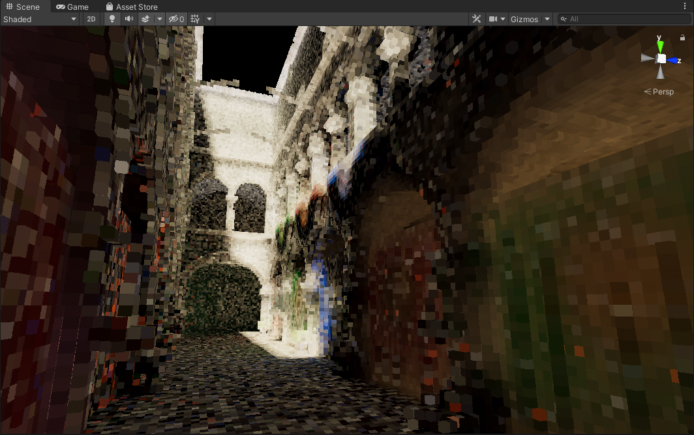
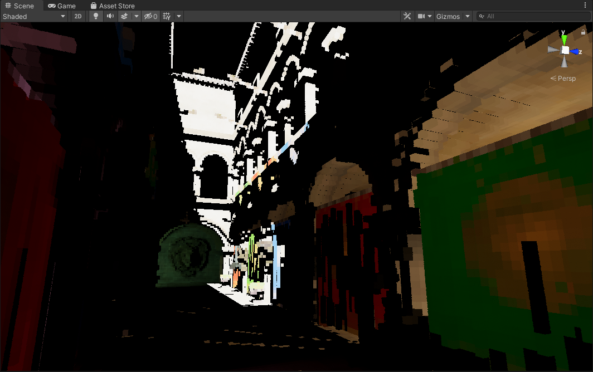
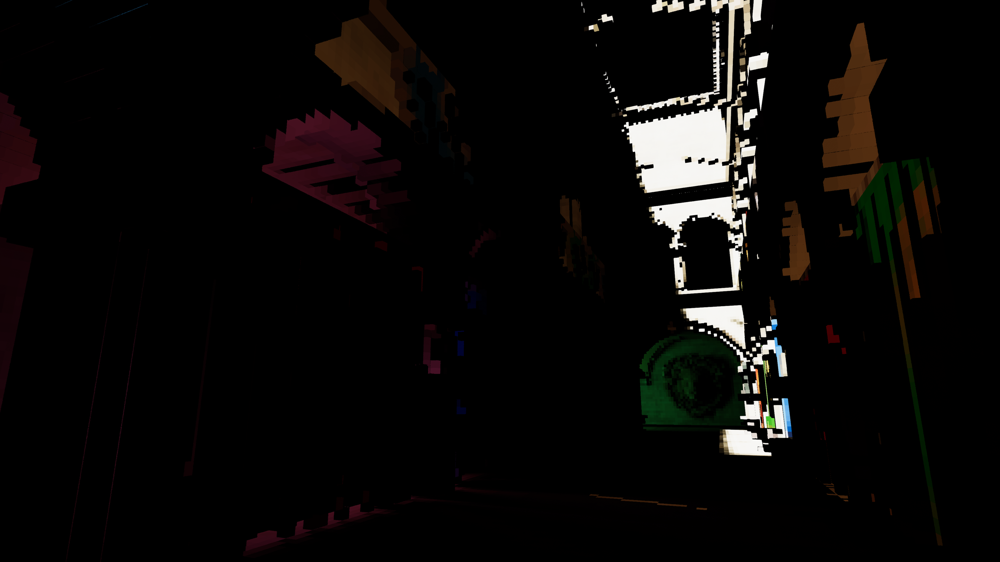
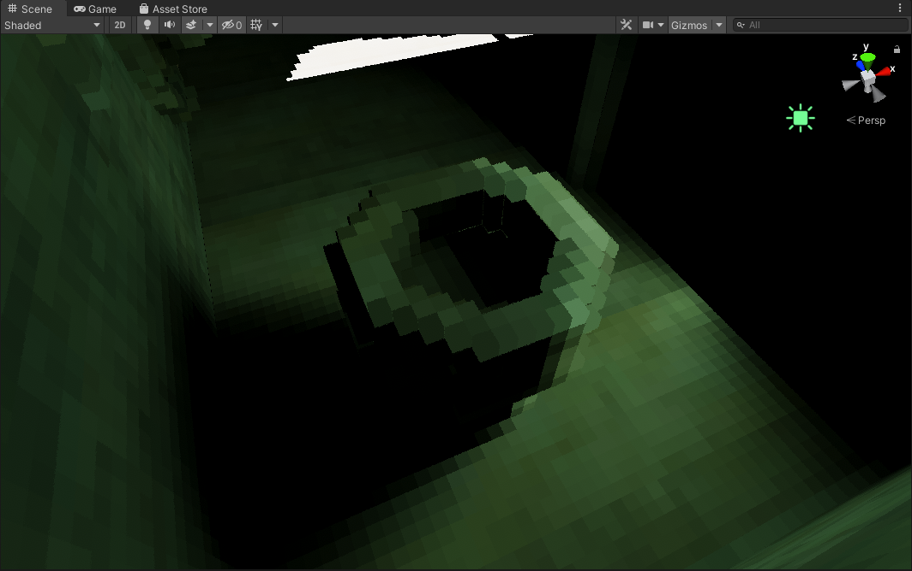
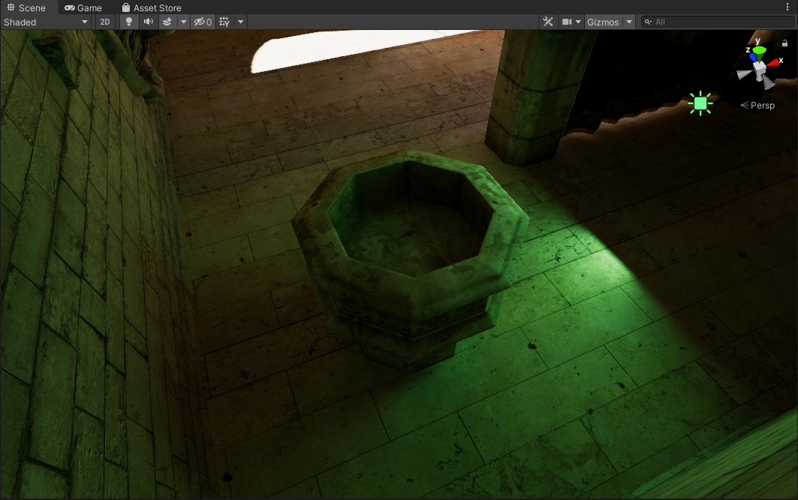
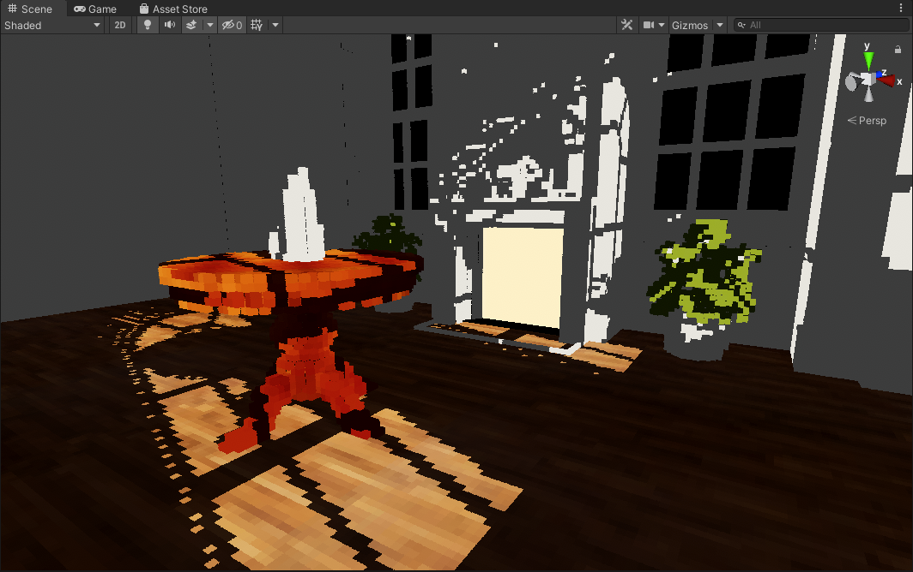

# Unity Voxel Tracer

Work in progress voxel tracer. This at the moment is intended to be an offline solution for lighting, so real-time framerates are not a necessity. 

With that said, there is still a LOT more to be improved and done...

### Features
- Direct Lighting *(Directional, Spot, Point, Area)*
- Bounce Lighting *(1 bounce)*
- Emissive Lighting *(1 bounce)*

### TODO / Ideas:
- Soft shadow support for Directional/Spot/Point lights.
- Environment Lighting support.
- Saving Volumetric Direct Lighting to the disk.
- Volumetric Bounce Lighting support.
- Add functionality for recursively doing multiple bounces. *(right now only 1 bounce is calculated, but more can be calculated recursively)*
- Geometry thickening to solve problems with light leakage *(conservative rasterization perhaps)*
- Normal Oriented Hemisphere Sampling works and improves quality, but the means of obtaining scene normals should be improved as in certain cases it can cause problems with turning surfaces dark.
- Optimization: Albedo Buffer format can be 8 bit
- Optimizing Scene Voxelization step.
- Optimizing the main compute shader, high sample counts often crash the editor.
- Optimizing/Improving the Sample Tiles, this is meant to split up the work load but it still can be too heavy. High tile count also creates too many files on the disk that eat up space.
- Would like to look into methods for potentially blurring and averaging results to improve quality. Something like a bilaterial blur that is "voxel aware" perhaps?

# Screenshots

*Voxel Trace: Bounce Lighting*

*Voxel Trace: Direct Lighting*

*Voxel Trace: Direct Lighting with Combined Bounce and Emissive Lighting.*

*Ground Truth*

*Voxel Trace: Direct Lighting with Area Lights with soft shadows.*

*Ground Truth*

*Voxel Trace: Early test with direct lighting*

*Ground Truth*