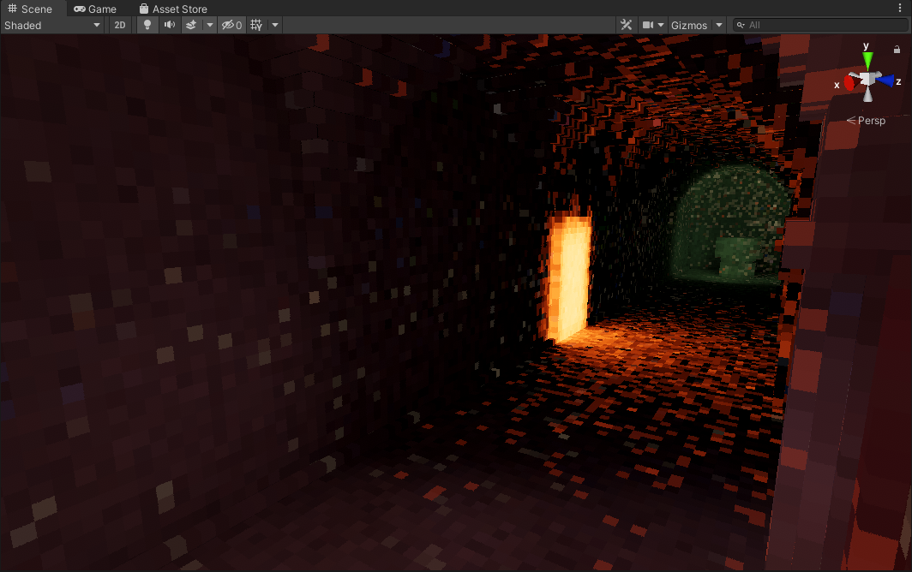
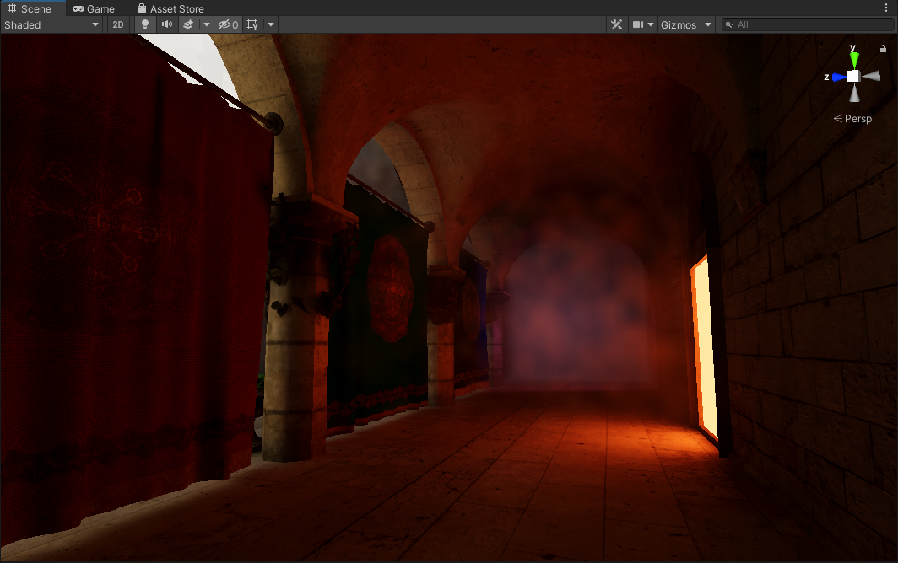
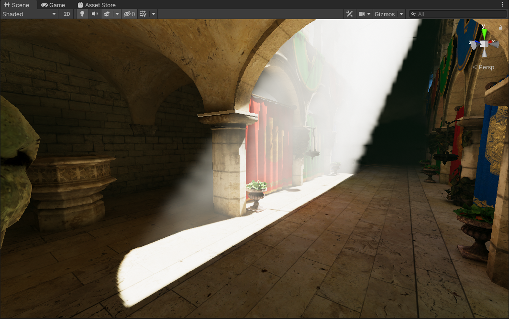

# Unity Voxel Tracer

Work in progress voxel tracer. This is intended to be an offline solution for generating lighting/volumetrics.

### Features
- Direct Lighting *(Directional, Spot, Point, Area)*
- Multi-Bounce Lighting
- Emissive Lighting
- Environment Lighting
- Volumetric Lighting

### TODO / Notes / Ideas:
- Geometry thickening to solve problems with light leakage *(conservative rasterization perhaps?)*
- Improving scene albedo/emissive buffer capture by using the "Meta" pass rather than a replacement shader to support custom shaders.
- Optimizing Scene Voxelization even further.
- Would like to look into methods for potentially blurring and averaging results to improve quality. Something like a bilaterial blur that is "voxel aware" perhaps?

# Screenshots

*Voxel Trace: Final Lighting*

*Voxel Trace: Direct Lighting*

*Voxel Trace: Single Bounce Environment Lighting.*

*Voxel Trace: Scene Albedo Buffer*

*Voxel Trace: Scene Normals Buffer*

*Voxel Trace: Emissive Lighting*

*Voxel Trace: Scene Emissive Buffer*

*Voxel Trace: Volumetric Emissive Lighting.*

*Voxel Trace: Final Volumetric Lighting.*

*Voxel Trace: Volumetric Direct Lighting Only.*

*Voxel Trace: Volumetric Bounced Lighting Only.*

*Voxel Trace: Volumetric Environment Lighting Only.*

### Why?

This tool came about with the need to make the [Baked Volumetrics](https://github.com/frostbone25/Unity-Baked-Volumetrics) effect no longer dependent on sampling from light probes in a scene. So building a voxel based raytracer was necessary, and here we are. It's worth noting that this tool serves as a foundation for potentially more things to come in the future *(Real-time Voxel Based GI, Voxel Based Specular Reflections, Voxel Lightmaps, Scene To Voxel Mesh, etc.)*

# Sources / References / Credits
- **[pema99](https://gist.github.com/pema99)**: Helped fix a big issue regarding TDR and GPU Readbacks for better baking stability, as well as additional advice and tips. *(Thank you!)*
- **[Morgan McGuire](https://casual-effects.com/data/)**:  Sample Scenes.
- **[Light Trees and The Many Lights Problem](https://psychopath.io/post/2020_04_20_light_trees)**
- **[Unity SRP Core Sampling.hlsl](https://github.com/needle-mirror/com.unity.render-pipelines.core/blob/master/ShaderLibrary/Sampling/Sampling.hlsl)**
- **[Unity SRP Core Random.hlsl](https://github.com/needle-mirror/com.unity.render-pipelines.core/blob/master/ShaderLibrary/Random.hlsl)**