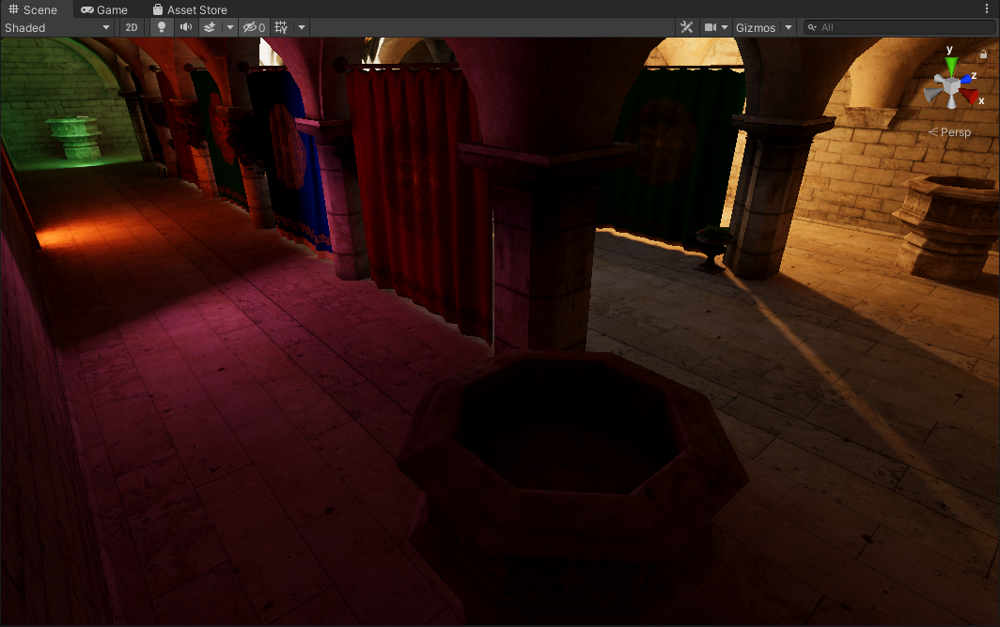
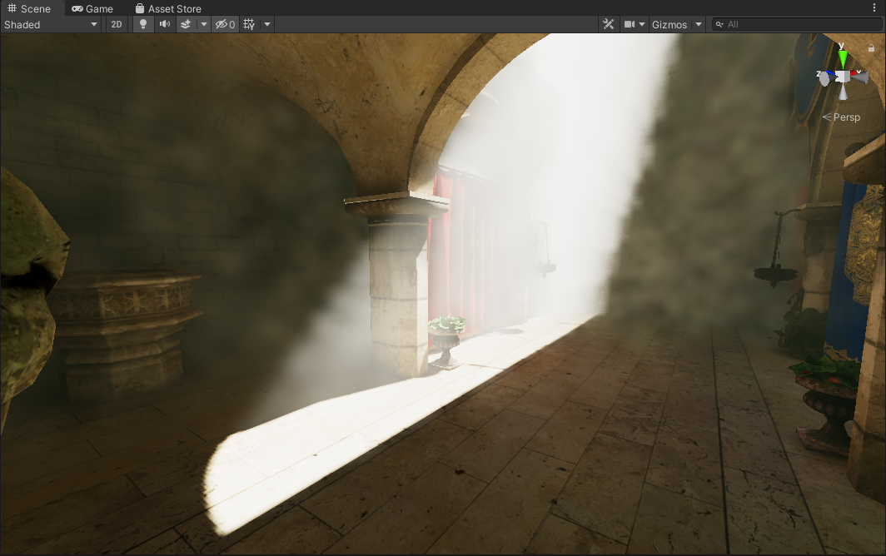
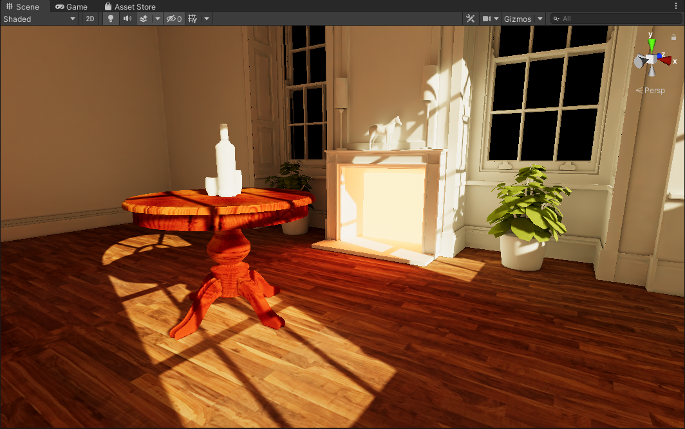

# Unity Voxel Tracer

Work in progress voxel tracer. This at the moment is intended to be an offline solution for lighting, so real-time framerates are not a goal at the moment. 

With that said, there is still a LOT more to be improved and done...

### Features
- Direct Lighting *(Directional, Spot, Point, Area)*
- Multi-Bounce Lighting
- Emissive Lighting
- Volumetric Lighting
- 3D Gaussian Blur Filter for Volumetric Lighting

### TODO / Notes / Ideas:
- Soft shadow support for Directional/Spot/Point lights.
- Environment Lighting support.
- Geometry thickening to solve problems with light leakage *(conservative rasterization perhaps?)*
- Normal Oriented Hemisphere Sampling works and improves quality, but the means of obtaining scene normals should be improved as in certain cases it can cause problems with turning surfaces dark.
- Optimizing Scene Voxelization even further.
- Optimizing the main compute shader, high sample counts often crash the editor.
- Would like to look into methods for potentially blurring and averaging results to improve quality. Something like a bilaterial blur that is "voxel aware" perhaps?
- Improving Compute Shader Dispatching, and waiting for when the GPU is actually free of anything. At the moment if you dispatch too often you will hit TDR and the editor will crash. I want to stall the CPU thread until the GPU is free so we can safely do another dispatch without crashing. *(There are cases oddly enough where we hit TDR randomly?)*

# Screenshots

*Voxel Trace: Bounce Lighting*

*Voxel Trace: Direct Lighting*

*Voxel Trace: Direct Lighting with Combined Bounce and Emissive Lighting.*

*Ground Truth*

*Voxel Trace: Direct Lighting with Area Lights with soft shadows.*

*Ground Truth*

*Voxel Trace: Volumetric Bounce Lighting with emissives. (Lots of noise due to low sample count)*

*Voxel Trace: Volumetric Direct Lighting.*

*Voxel Trace: Volumetric Direct + Bounce Lighting. (Lots of noise due to low sample count)*

*Voxel Trace: Early test with direct lighting*

*Ground Truth*